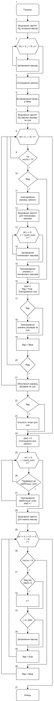

# Лабораторна робота №11. Вступ до показчиків
## Вимоги:
-   Розробник: Зеленець Олена, група КІТ-120а
-   Загальне завдання: Реалізувати програму з використанням показчиків.
- Індивідуальне завдання: Реалізувати програму, яка знаходить безперервну послідовність чисел у взідному масиві, сума елементів якої максимальна, та переписати їх у вихідний масив.

 ## Опис програми 1:

 - *Функціональне призначення*:  Створити новий вихідний масив, який матиме безперервну послідовність позитивних чисел, сума елементів якого максимальна.

 - *Опис логічної структури*: 
    * Оголошуємо функцію `main` та виділяємо пам'ять для вхідного масиву (блок 1-2).
    * Створюємо цикл для заповнення вхідного масиву(блок 3-4).
    * Оголошуємо змінні суми, розміру для майбутніх масивів та змінної, яка відповідає за початок потрібної послідовності(блок 5).
    * Встановлюємо значення флагу: flag = false(блок 6)
    * Виділяємо пам'ять під масив розмірів та сум(блок 7)
    * Створюємо цикл, який перевіряє чи більше число за 0 і якщо більше, то переходимо далі.(блок 8-9).
    * Перевіряємо стан флагу, і якщо він досі false(блок 10), то переходимо далі, а якщо ні, то відбувається перехід до блоку 16.
    * Знаходимо значень змінних (збільшуємо значення count_sum на 1, а значенню змінної start присвоюємо значення i(блок 11)
    * Виділяємо пам'ять під тимчасові значення масивів(блок 12)
    * Створюємо цикл, який заповнюватиме тимчасові масиви(блок 13-14)
    * Присвоюємо значення з тимчасових масивів(блок 15).
    * Значення змінної розміру збільшуємо на одиницю. Встановлюємо флаг в true (flag=true). Знаходимо суми чисел, які є більшими за нуль(блок 16).
    * Якщо число було менше за нуль, то створюємо нове розгалуження(блок 17). Якщо flag=true, то сума буде дорівнювати попередньому значенню(блок 18). 
    * Після цього flag=false(блок 19)
    * При умові, що flag=false виконується обнулення значень розмірів та суми(блок 21)
    * Якщо flag=true, то сума і розміри будуть дорівнювати попереднім значенням(блок 22-23)
    * Встановлюємо значення змінної start в нуль(блок 24)
    * Створюємо цикл, у якому перевіряється найбільша сума із уже знайдених сум(блок 25-26)
    * Знаходимо і присвоюємо найбільшому значенню змінної із значенням, щоб дізнатися номер за порядком і результат присвоюємо змінній start(блок 27).
    * Виділяємо пам'ять для нового вихідного масиву(блок 28)
    * Оголошуємо цикл, завдяки виконанню якого будемо заповнювати масив(блок 29).
    * Перевіряємо чи число менше нуля(блок 30), і якщо так, то повертаємося на початок циклу(блок 29) та збільшуємо значення i на 1.
    * Якщо число більше нуля, то перевіряємо чи flag=false і щоб start не дорівнював 0. (блок 31). 
    * Якщо все правильно, то переходимо до блоку 32, у якому збільшується значення j. Якщо ні, то переходимо до блоку 33.
    * Якщо j == start, то заповнюємо масив(блок 33-34).
    * flag=true(блок 35)
    * Кінець програми(return 0;).
 - *Блок-схема алгоритму функції:*

     

Рисунок 1 — блок-схема програми
- *Важливі елементи програми:*
Перевірка на додатність числа, встановлення початку потрібної числової послідовності згідно завдання.

## Варіанти використання програми 1:
- Поставивши точку зупинки наприкінці функції побачимо значення вхідного та вихідного масивів.

## Висновок:
Для виконання лабораторної роботи ми навчились створювати та реалізовувати алгоритми функцій, створювати блок-схеми алгоритмів та оформляти документацію.
