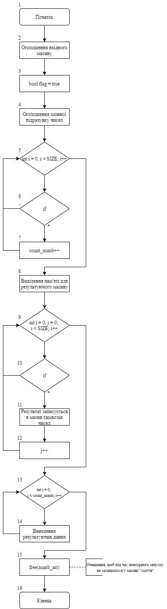
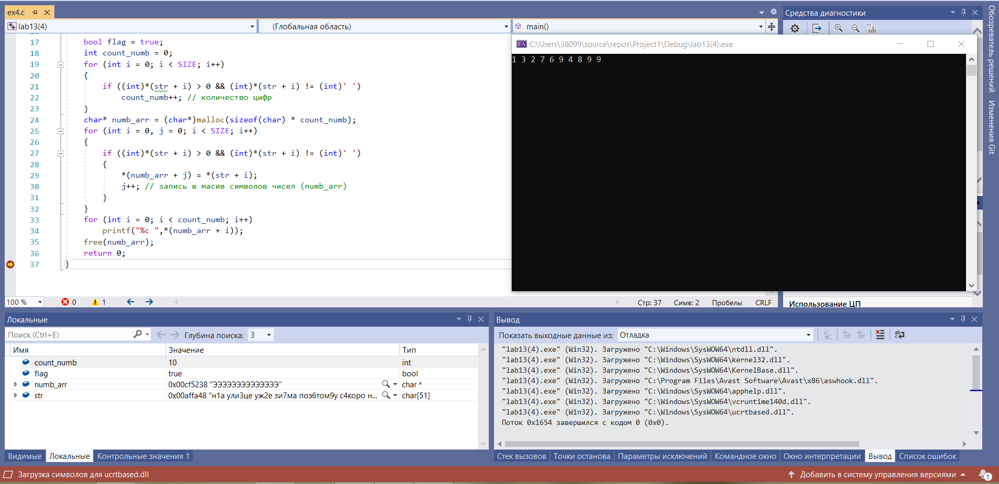

# Лабораторна робота №13. Строки
## Вимоги:
-   Розробник: Зеленець Олена, група КІТ-120а
-   Загальне завдання: Реалізувати програму з використанням строк.
- Індивідуальне завдання: Реалізувати програму, яка знаходить всі числа, які зустрічаються у тексті вхідного масиву, та переписує їх у новий вихідний масив.

 ## Опис програми:

 - *Функціональне призначення*:  Створити новий вихідний масив, який міститиме у собі всі числа, які зустрічаються в тексті.

 - *Опис логічної структури*: 
  
    - У функції `int main` оголошується вхідний масив, тобто рядок заданого розміру, який містить у собі текст(блок 2).
    - Вказується значення флагу: `bool flag = true`(блок 3).
    - Та оголошується змінна, яка відповідає за підрахунок кількості цифр у тексті(блок 4).
    - Далі створюємо цикл і вказуємо умову, що якщо елементи масиву рядка більші  за 0 та елементи масиву рядка не дорівнюють «роздільнику» (блок 5-6), то кількість чисел збільшується(блок 7).
    - Далі виділяється пам'ять для нового результуючого масиву numb_arr(блок 8).
    - І далі розпочинаємо цикл та вказуємо умову, що якщо елементи масиву рядка більші 0 та елементи масиву рядка не дорівнюють «роздільнику», то в створений результуючий масив записуються перевірені елементи рядка, тобто знайдені числа(блок 9, 10, 11). 
    - Тоді елементи рядка збільшуються(блок 12).
    - Далі відбувається виведення результату, тобто новоствореного масиву з чисел, які зустрічаються в тексті(блок 13-14).
    - Далі підключаємося команду free для «очищення»(блок 15).
    - Кінець функції: `return 0;`(блок 16).

 - *Блок-схема алгоритму функції:* (рис. 1)

     

Рисунок 1 — Блок-схема програми
- *Важливі елементи програми:*
    - Знаходження кількості цифр у тексті завдяки функції count_numb.
    - Виокремлення усіх наявних цифр із загального тексту.
    - Заповнення вихідного масиву значеннями, які відповідають умові завдання.

## Варіанти використання програми:
- Поставивши точку зупинки наприкінці функції побачимо значення вхідного та вихідного масивів. (рис. 2)
    
Рисунок 2 - Перевірка правильності коду та виведення значень вихідного масиву.
## Висновок:
Для виконання лабораторної роботи ми навчились створювати та реалізовувати алгоритми функції, створювати схеми алгоритмів, вивчили функції strcpy, strtok та інші, розділяли елементи рядка на "відрізки", вираховували частотність повторювання символів у тексті.

