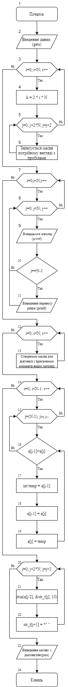
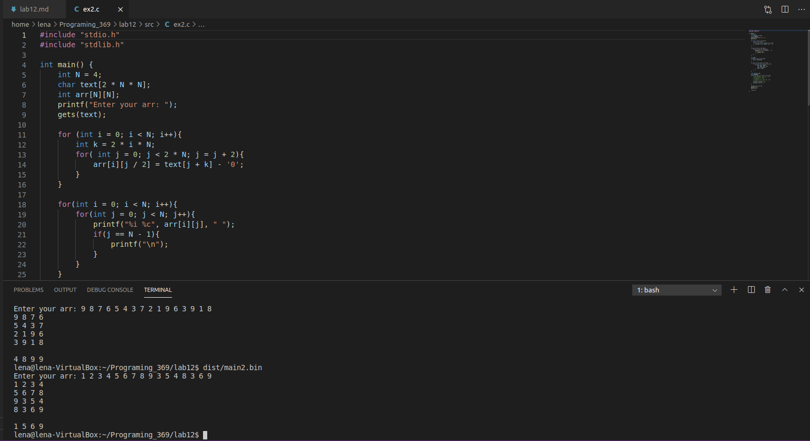

# Лабораторна робота №12
# Тема: Взаємодія з користувачем шляхом механізму введення/виведення
## Вимоги:
-   Розробник: Зеленець Олена, група КІТ-120а
-   Перевірив: асистент Челак Віктор Володимирович
-   Загальне завдання: Програму, яка була розроблена в попередній лабораторній роботі переробити так, щоб початкові дані вводилися з клавіатури, видача результуючих даних провадилась у консоль, та щоб при запиті даних користувач отримував повідомлення, що від нього очікують, використовуючи при цьому різні функції введення/виведення такі як: printf() і scanf(), gets() і puts(), getc() і putc() та write() і read().
- Індивідуальне завдання: Створити масив розмірністю N*N, елементи головної діагоналі записати в одновимірний масив, а отриманий масив упорядкувати за зростанням, використовуючи при цьому функції введення/виведення gets() і puts().

 ## Опис програми:

 - *Функціональне призначення*:  Створити новий вихідний масив, який міститиме у собі головну діагональ матриці, яка буде відсортована за зростанням.

 - *Опис логічної структури*: 
  
    - За допомогою функції gets() приймаємо змінну text, яка містить у собі масив чисел(блок 2);
    - Перетворюємо масив в тип int, щоб здійснювати необіхідні розрахунки(блок 3-6)
    - Упорядковуємо наш масив у матрицю(блок 7-11);
    - Створюємо масив для діагоналі і присвоюємо йому елементи нашої матриці(блок 12-13);
    - Сортуємо масив(в нашому випадку методом бульбашки) для виділення головної діагоналі матриці(блок 14-19);
    - Перетворюємо масив в тип char і записуємо з урахуванням пробілів(блок 20-22); 
    - Виводимо масив з діагоналлю за допомогою фунції виведення puts()(блок 23).
    - Кінець програми(блок 24).
- *Блок-схема алгоритму функції:* (рис. 1)
    
    

Рисунок 1 — Блок-схема програми

- *Важливі елементи програми:*
    - Створення матриці розмірністю N*N; 
    - Сортування матриці для виділення головної діагоналі;
    - Створення вихідного масиву з діагоналлю, відсортованою за зростанням;
    - Здійснення всього шляхом функцій введення/виведення gets() і puts().

## Варіанти використання програми:
- Поставивши точку зупинки наприкінці функції побачимо значення вхідного та вихідного масивів. (рис. 2)
    

Рисунок 2 - Перевірка правильності коду та виведення значень вихідного масиву.
## Висновок:
На цій лабораторній роботі ми навчилися реалізовувати програми, у яких опрацювання даних здійснюється функціями введення/виведення, а саме: printf() і scanf(), gets() і puts(), getc() і putc() та write() і read().

