# Лабораторна робота №14
# Тема: Взаємодія з файлами.
## Вимоги:
-   Розробник: Зеленець Олена, група КІТ-120а
-   Первірив: асистент Челак Віктор Володимирович
-   Загальне завдання: Змінити програму, яка була розроблена у попередній роботі(робота зі строками) так, щоб початкові данs вводилися з файлу, видача результуюччих даних провадилася не тільки у консоль, але й у файл, ім'я вхідного та результуючого файлу повинно бути отримане від користувача, а також при запиті даних користувач отримував повідомлення, що від нього очікуюсь. Вивести структуру файлів і каталогія як це робить утиліта Linux tree. Визначити об'єм запитаного каталогу, результат нормалізувати згідно вимог.
- Індивідуальне завдання: Виконати загальне завдання з переробленою програмою попередньої роботи, а саме: знайти всі числа, які зустрічаються у тексті вхідного масиву, та переписати їх у новий вихідний масив.

 ## Опис програми:

 - *Функціональне призначення*:  Виведення структури файлів та каталогів та визначення об'єму запитаного каталогу за допомогою різних розроблених функцій (команд).

 - *Опис логічної структури функції `int main`*: 
  
    - Викликається функція run_command, яка починає роботу будь-якої команди.

 - *Блок-схема алгоритму функції `int main`:* (рис. 1)

   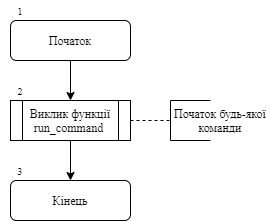

Рисунок 1 — Блок-схема функції `int main`

 - *Опис логічної структури функції `read_file`*: 
  
    - Створюємо файл, виводиться щапит користувачеві про введення назви файлу та вводиться дана назва(блок 2-4);
    - Читаємо дані із файлу(блок 5-6);
    - Далі умова: поки не кінець файлу і++(блок 7-8);
    - Виводиться текст на екран та закриваємо файл(блок 9-10).

 - *Блок-схема алгоритму функції `read_file`:* (рис. 1)

   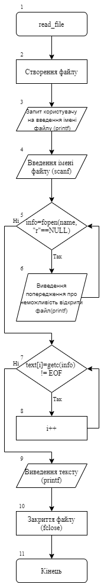

Рисунок 1 — Блок-схема функції `read_file` 
 
 - *Опис логічної структури функції `stop_work`(вихід з команди)*: 
  
    - Відбувається вихід із будь-якої команди.

 - *Блок-схема алгоритму функції `stop_work`:* (рис. 2)
   
   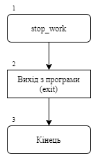

Рисунок 2 — Блок-схема функції `stop_work`

 - *Опис логічної структури функції `write_file`(запис у файл)*: 
  
    - Створюємо вхідний та вихідний файли, виводимо запит користувачу на введення назви файлу, який читається і вводимо його(блок 2-4);
    - Читаємо дані з файлу(блок 3-4);
    - Доки не кінець файлу, то і++;
    - Виводимо запит користувачу на введення назви файлу, який записуватимемо і вводимо його(блок 10-11);
    - Записуємо дані й файл(блок 12-13);
    - Коли елемент тексту не є кінцем файлу або пробілом, то кількість цифр збільшується(блок 14-16);
    - Виділяємо пам'ять для результуючого масиву, записуємо в результуючий масив числа з початкового масиву(блок 18-21);
    - Виводимо цей масив чисел на екран, записуємо його у вихідний файл і також виводимо між ними пробіли(блок 22-26);
    - Виводимо перенос рядка, за допомогою функції free() очищуємо масив перед повторним запуском, закриваємо вхідний та вихідний файли(блок 27-30).

 - *Блок-схема алгоритму функції `write_file`:* (рис. 3)

   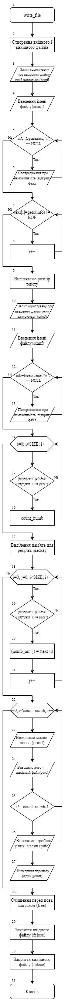

Рисунок 3 — Блок-схема функції `write_file`

 - *Опис логічної структури функції `change_dir`(зміна шляху до файлу)*: 
  
    - Оголошуємо змінну, яка містить у собі шлях до файлу, виводимо запит для користувача про введення назви шляху до файлу, вводимо цей шлях(блок 2-4);
    - Встановлюємо робочу папку, копіюємо даний шлях для обробки(блок 5-6);
    - Виводимо поточний шлях(блок 7).

 - *Блок-схема алгоритму функції `change_dir`:* (рис. 4)

   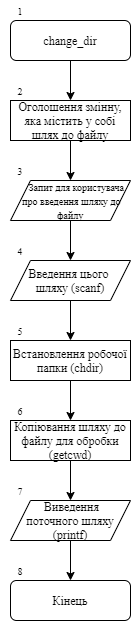

Рисунок 4 — Блок-схема функції `change_dir`

 - *Опис логічної структури функції `move_up`(перехід на попередню позицію)*: 
  
    - Оголошуємо змінну, яка міститиме у собі шлях до файлу, копіюємо цей шлях для обробки, встановлюємо його розмір(блок 2-4);
    - При даній умові прибираємо кожен елемент останньої ще існуючої позиції, до "/"(блок 5-7);
    - Встановлюємо нову робочу папку, копіюємо новий шлях та виводимо поточний шлях на екран(блок 8-10).

 - *Блок-схема алгоритму функції `move_up`:* (рис. 5)

   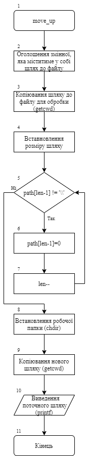

Рисунок 1 — Блок-схема функції `move_up`

 - *Опис логічної структури функції `move_down`(перехід на наступну позицію)*: 
  
    - Виділяємо пам'ять на шлях, який буде додаватися до існуючого, копіюємо шлях для обробки, встановлюємо розмір шляху поточного і доданого(блок 2-4);
    - Додаємо перед новою частиною шляху "\";
    - Додаємо елементи доданого шляху з урахуванням першого символу, який не входить у дану адресацію(блок 6-7);
    - Очоголошуємо кінець шляху(блок 8).

 - *Блок-схема алгоритму функції `move_down`:* (рис. 6)

   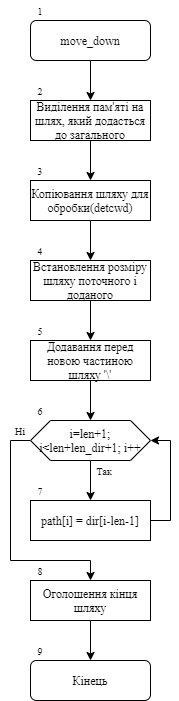

Рисунок 6 — Блок-схема функції `move_down`

 - *Опис логічної структури функції `f_size`(визначення розміру файлу)*: 
  
    - Створюємо файл(блок 2);
    - Якщо виконується умова, що це не папка, то повертаємо значення покажчика в файлі для вказано потоку(блок 3-4);
    - Інакше розмір дорівнює нулю(блок 5-6);
    - Закриваємо файл(блок 7).

 - *Блок-схема алгоритму функції `f_size`:* (рис. 7)

   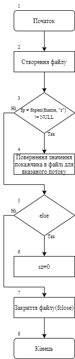

Рисунок 7 — Блок-схема функції `f_size`

 - *Опис логічної структури функції `get_size`(отримання розміру файла чи каталогу)*: 
  
    - Встановлюємо робочу папку та створюємо структуру(блок 2-3);
    - Далі встановлюємо умову при якій отримуємо шлях до файлу і якщо розмір того, що ми отримали не дорівнює нулю, то це файл і тому до загального розміру директорії додаємо розмір файлу(блок 4-10);
    - Інакше це папка і ми додаємо до розміру директорії розмір папки, закриваємо директорію(блок 11-15);
    - Якщо не виконуються ці умови, то значить, що ми ввели шлях не до папки, а до файлу і виходимо з програми(блок 16-18). 

 - *Блок-схема алгоритму функції `get_size`:* (рис. 8)

   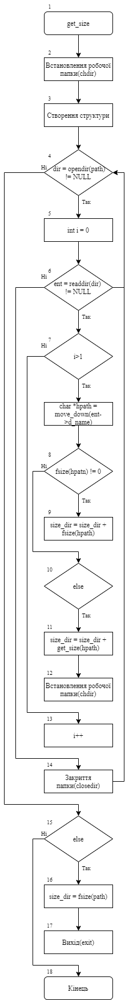

Рисунок 8 — Блок-схема функції `get_size`

 - *Опис логічної структури функції `tree`(виведення структури каталогів та файлів)*: 
  
    - Встановлюємо робочу папку та створюємо структуру(блок 2-3);
    - Далі встановлюємо шлях до зчитуваного  елемента директорії, і якщо розмір того, що ми отримали не дорівнює нулю, то це файл і тому записуємо ім'я елементу директорії(блок 4-10);
    - Інакше це папка і ми записуємо ім'я папки та відкриваємо цю папку повторним викликом функції `tree`(блок 11-15);
    - Якщо не виконуються ці умови, то значить, що ми ввели шлях не до папки, а до файлу і виходимо з програми(блок 16-18).

 - *Блок-схема алгоритму функції `tree`:* (рис. 9)

   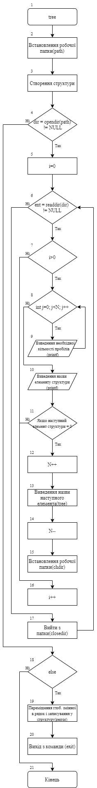

Рисунок 9 — Блок-схема функції `tree`

- *Опис логічної структури функції `run_command`(початок роботи вказаної необхідної команди)*: 
  
    - Виведення запиту для користувача на введення символу(типу команди), який означає назву команди чи назву команди цілком, оголошення рядка, який міститиме назву команди та введення цього типу(блок 2-4);
    - Якщо вводимо початкові літери команд на зміну шляху до файлу, читання з файлу, записування у файл, зупинку будь-якої команди, то викликаються відповідні функції(блок 5-13);
    - Далі при вказанні типу 't' оголошуємо рядок, який міститме шлях до файлу, копіюємо шляхх для обробки, виводмо цей шлях та викликаємо команду `tree`(блок 14-18);
    - Вказуємо тип '.' для виклику функції переходу на попередню позицію(блок 19-20);
    - Далі при вказанні типу 'm' оголошуємо рядок, який міститиме у собі назву папки, виводимо запит користувачу на введення назви папки, вводимо цю назву, додаємо у початковий шлях новостворений і встановлюємо робочу папку, копіюємо шлях для обробки, виводимо утворений шлях(блок 21-28);
    - Далі при вказанні типу 's' оголошуємо шлях до файлу, виводимо запит користувачу на введення шляху до файлу, вводимо цей шлях, дізнаємо розмір файлу і вказуємо умови при яких розмір виводиметься у гігабайтах, магабайтах та байтах в залежності від "величини" файлу, виводимо розмір директорії(блок 29-47);
    - Викликаємо функцію `run_command`(блок 48).

 - *Блок-схема алгоритму функції `run_command`:* (рис. 10)

   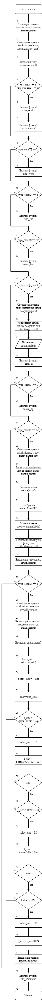

Рисунок 10 — Блок-схема функції `run_command`

- *Важливі елементи програми:*
    - Зчитування та запис у файл, взагалі взаємодія з файлами;
    - Робота зі структурами;
    - Виведення структури файлів та каталогів;
    - Точне визначення розміру файлів та директорії разом, нормалізація цього розміру згідно вимог.
## Варіанти використання програми:
- Поставивши точку зупинки наприкінці функції побачимо результати виконання відповідних команд на виведення структури заданого каталогу і його розмір.(рис.11-12)
    
    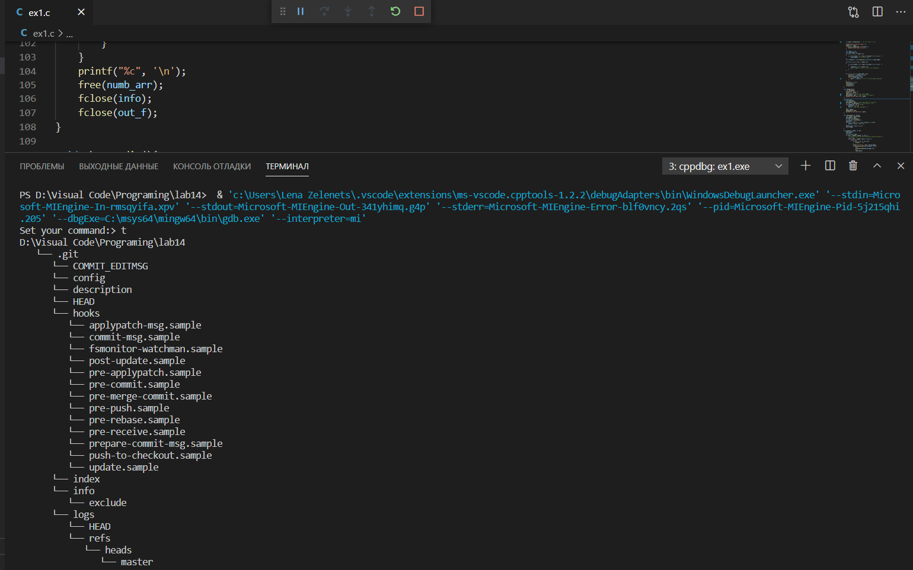

Рисунок 11 - Результати команди `tree`.

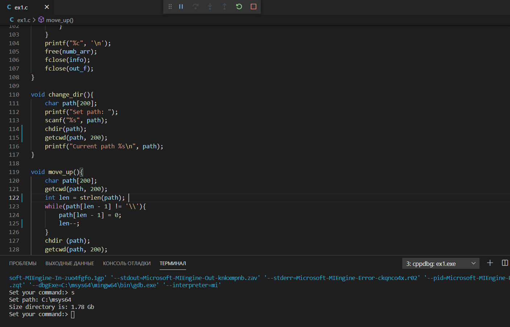
Рисунок 12 - Результати команди `get_size`.
## Висновок:
На цій лабораторній роботі ми закріпили знання та навички в роботі з файлами, створили прототип утиліти Linux tree та навчилися визначати об'єм запитаного каталогу з нормалізованим форматом розміру.

