# Лабораторна робота №2
# Тема: Структуровані типи даних. Модульні тести.
## Вимоги:
-   Розробник: Зеленець Олена, група КІТ-120а
-   Первірив: асистент Челак Віктор Володимирович
-   Загальне завдання: З розділу "Розрахункове завдання / Індивідуальні завдання" взяти прикладну галузь стосовно номеру варіанту за поперденьо-визначеною формулою, створити структуру, що відображає "базовий клас". Для розробленого функціоналу по роботі з прикладною областю додати методи - модульні тести, що демонструють коректність роботи розробленого функціоналу. Розроблені методи мають перевірити коректність функціонування функцій на наборі заздалегідь визначених вхідних-вихідних даних. У ході роботи кожного тесту має виводитися інформація про ім'я функції-тесту, а також статус верифікації(пройшов / не пройшов). Якщо верифікація не пройшла, вивести на екран, що саме не пройшло перевірку.
- Індивідуальне завдання: 
   - Виконати завдання на оцінку "задовільно" та "добре" згідно варіанту; виконати запис та читання масиву структур(з заздалегідь відомою кількістю елементів) у двох форматах(текстовому та бінарному); при бінарному методі зберігання структур виконати пошук та читання структури з файлу по індексу;

 ## Опис програми:

 - *Функціональне призначення*:  Виведення структури файлів та каталогів та визначення об'єму запитаного каталогу за допомогою різних розроблених функцій (команд).

 - *Опис логічної структури функції `int main`*: 
  
    - Викликається функція run_command, яка починає роботу будь-якої команди.

 - *Блок-схема алгоритму функції `int main`:* (рис. 1)

   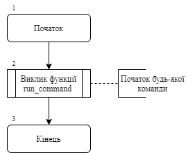

Рисунок 1 — Блок-схема функції `int main`

 - *Опис логічної структури функції `readStr` (функція читання рядків)*: 
  
    - Створюємо файл та відкриваємо його у режимі зчитування;
    - Отримуємо з файлу кількість рядків;
    - Зчитуємо всі рядки у файл.

 - *Блок-схема алгоритму функції `readStr`:* (рис. 2)

   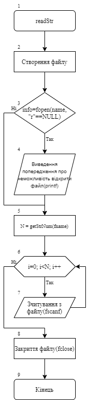

Рисунок 2 — Блок-схема функції `readStr` 
 
 - *Опис логічної структури функції `getStrNum`(функція для отримання кількості рядків)*: 
  
    - Створюємо файл та відкриваємо його у режимі зчитування;
    - Вводимо змінну для кількості рядків;
    - Зчитуємо посимвольно і при цьому відповідно збільшується кількість рядків;
    - Закриваємо файл;
    - Повертаємо значення `N`.

 - *Блок-схема алгоритму функції `getStrNum`:* (рис. 3)
   
   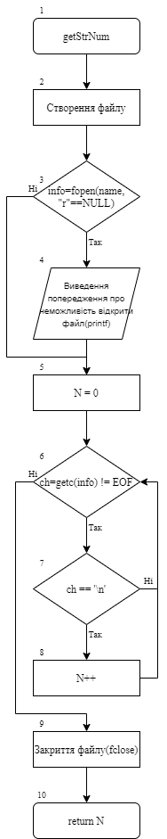

Рисунок 3 — Блок-схема функції `getStrNum`

 - *Опис логічної структури функції `getStrNumBin`(функція для отримання кількості рядків у бінарному форматі)*: 
  
    - Створюємо файл;
    - Зчитуємо кількість структур;
    - Отримуємо число елементів;
    - Закриваємо файл;
    - Повертаємо значення `n`.

 - *Блок-схема алгоритму функції `getStrNumBin`:* (рис. 4)

   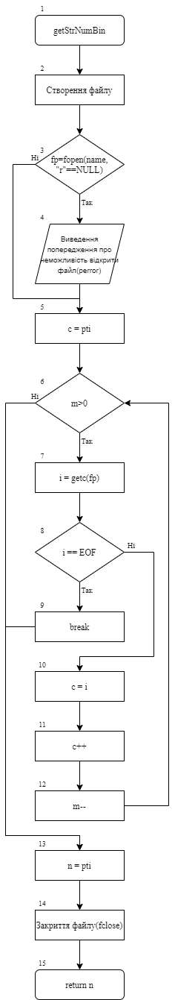

Рисунок 4 — Блок-схема функції `getStrNumBin`

 - *Опис логічної структури функції `writeStr`(запис рядків у файл)*: 
  
    - Створюємо файл;
    - Вікриваємо в режимі запису;
    - Записуємо кожен елемент структури у файл;
    - Закриваємо його.

 - *Блок-схема алгоритму функції `writeStr`:* (рис. 5)

   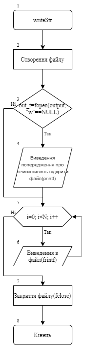

Рисунок 5 — Блок-схема функції `writeStr`

 - *Опис логічної структури функції `sortChar`(Сортування структур)*: 
  
    - Якщо поточний елемент структури більший за наступний елемент структури, то повертається 1;
    - Якщо поточний елемент структури менший за наступний елемент структури, то повертається 0;
    - Якщо вони рівні переходимо на наступний елемент;
    - Поки ці елементи не рівні довжині рядка, результат функції сортування записується в r і повертається.

 - *Блок-схема алгоритму функції `sortChar`:* (рис. 6)

   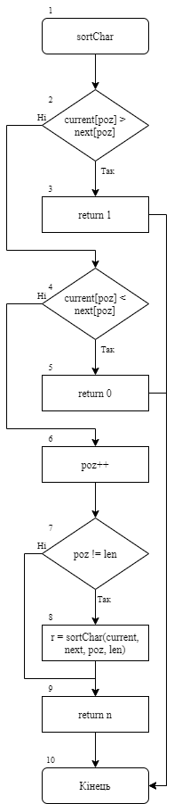

Рисунок 6 — Блок-схема функції `sortChar`

 - *Опис логічної структури функції `sortStr`(Сортування певної потрібної користувачеві частини структури)*: 
  
    - Якщо користувач вказує тип номера поїзда, то оголошується змінна довжини рядка, і якщо довжина номера поточного потяга(j) більше наступного номера(j+1), то в довжину рядка записується наступний номер(j+1), якщо умова не виконується, то записується перший. Далі відбувається сортування номерів;
    - Якщо користувач вказує тип необхідності ремонту, то відбувається сортування цих даних кожного потяга, де порівнюються дані одного потяга з наступним;
    - Якщо користувач вказує тип кількості вагонів у кожному потязі, то також відбувається сортування шляхом порівняння кількості вагонів одного потяга з наступним;
    - Якщо користувач вказує тип пункту відправлення поїзду, то оголошується змінна довжини рядка, і якщо довжина пункту відправлення одного поїзду(j) більше довжини рядка пункту відправлення наступного поїзду(j+1), то в довжину рядка записується наступний пункт віправлення(j+1), якщо умова не виконується, записується перший. Далі відбувається сортування пунктів відправлення;
    - Якщо користувач вказує тип пункту прибуття поїзду, то оголошується змінна довжини рядка, і якщо довжина пункту прибуття одного поїзду(j) більше довжини рядка пункту прибуття наступного поїзду(j+1), то в довжину рядка записується наступний пункт прибуття(j+1), якщо умова не виконується, записується перший. Далі відбувається сортування пунктів прибуття;
    - По такому ж принципу сортується тип потяга;
    - Якщо користувач вказує тип `d`, то виконується сортування у зворотній порядок.

 - *Блок-схема алгоритму функції `sortStr`:* (рис. 7)

   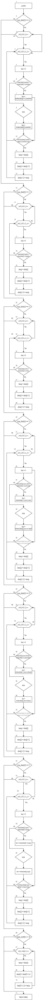

Рисунок 7 — Блок-схема функції `sortStr`

 - *Опис логічної структури функції `Metod1`(Сортування поїздів за кількістю вагонів та необхідністю ремонту)*: 
  
    - Створюємо вихідний файл;
    - Відкриваємося його на режим запису;
    - Якщо кількість вагонів потягу більша, ніж задано користувачем та задовольняє умову необхідності ремонту теж відповідно задану користувачем, то цей потяг виводиться на екран та записується у вихідний файл;
    - Закриваємо файл.

 - *Блок-схема алгоритму функції `Metod1`:* (рис. 8)

   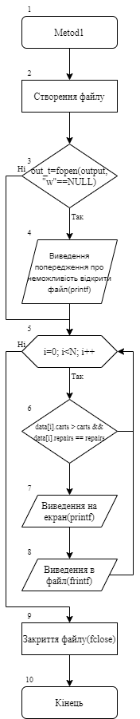

Рисунок 8 — Блок-схема функції `Metod1`

 - *Опис логічної структури функції `changeTrain`(заміна користувачем значень характеристик потяга)*: 
  
    - Виводиться запит користувачеві, характеристики якого саме потяга потрібно змінити(потяг визначається по своєму номеру). Далі виводяться запити на введення нових значень кожної характеристики. Якщо необхідності змінювати якусь характеристику немає, то користувачеві достатньо вказати символ `-` і тоді дані цієї характеристики запишуться без змін.
    - Як результат повертаються дані структури уже із усіма змінами у характеристиках.

 - *Блок-схема алгоритму функції `changeTrain`:* (рис. 9)

   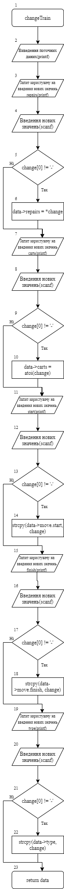

Рисунок 9 — Блок-схема функції `changeTrain`

 - *Опис логічної структури функції `get_rand_range_int`*: 
  
    - Отримання числа, заповненого рандомом.

 - *Блок-схема алгоритму функції `get_rand_range_int`:* (рис. 10)

   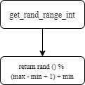

Рисунок 10 — Блок-схема функції `get_rand_range_int`

- *Опис логічної структури функції `setNewTrain`(створити новий потяг)*: 
  
    - Зчитуються дані структури, до яких потім додаватимуться нові елементи;
    - За допомогою змінних формується номер потяга: із першої букви(при умові, якщо номер дорівнює 10000, то до коду букви А додається 1 і тим самим утворбється буква В, і відповідно так далі), та цифер(до останнього номера понятгу додається 1 і т.д.). Ці дані записуються разом - так утворюються нові номера потягів;
    - Далі за допомогою рандомізації ми указуємо конкретні варінти, які можуть бути у різних характеристиках. І таким чином рандомно заповнюються усі характеристики кожного нового потягу;
    - Створюємо файл і відкриваємо його на режим приєднання до файлу;
    - Записуємо всі значення у файл;
    - Очищуємо дані перед повторним записом;
    - Закриваємо файл.

 - *Блок-схема алгоритму функції `setNewTrain`:* (рис. 11)

   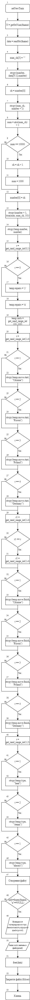

Рисунок 11 — Блок-схема функції `setNewTrain`

- *Опис логічної структури функції `writeBin`(запис у файл в бінарному форматі)*: 
  
    - Створюємо файл;
    - Вікдриваємо його в спеціальному режимі запису в бінарному форматі;
    - Записуємо кількість структур;
    - Посимвольно записуємо у файл всі структури;
    - Закриваємо файл.

 - *Блок-схема алгоритму функції `writeBin`:* (рис. 12)

   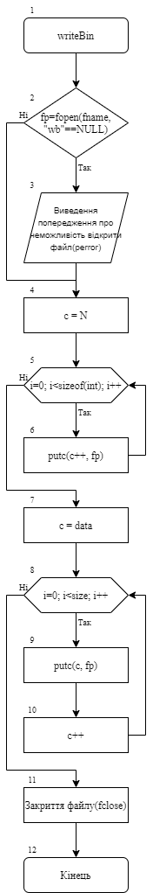

Рисунок 12 — Блок-схема функції `writeBin`

- *Опис логічної структури функції `readBin`(зчитування структури в бінарному форматі)*: 
  
    - Створюємо файл;
    - Відкриваємо файл в режимі зчитування;
    - Зчитуємо кількість структур;
    - Отримуємо число елементів;
    - Після запису зчитуємо посимвольно з файлу;
    - Перебирання загружених елементів та їх виведення на консоль;
    - Виведення на екран;
    - Очищуємо перед повторним запуском;
    - Закриваємо файл.

 - *Блок-схема алгоритму функції `readBin`:* (рис. 13)

   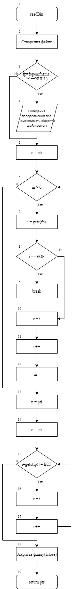

Рисунок 13 — Блок-схема функції `readBin`

- *Опис логічної структури функції `findBin`(передача об'єктів структури в функцію, які обов'язково повинні передаватися "за вказівником")*: 
  
    - Створюємо файл;
    - Відкриваємо файл в режимі зчитування;
    - Зчитуємо кількість структур;
    - Отримуємо кількість елементів;
    - Після запису зчитуємо посимвольно з файлу;
    - Перебирання загружених елементів та їх виведення на консоль;
    - Якщо порівняння номера із номером переданим по вказівнику дорівнює 0, то відбувається виведення на екран структури переданої за вказівником;
    - Очищуємо перед повторним запуском;
    - Закриваємо файл.

 - *Блок-схема алгоритму функції `findBin`:* (рис. 14)

   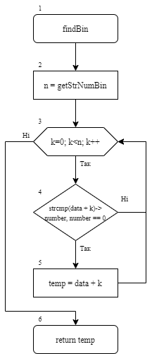

Рисунок 14 — Блок-схема функції `findBin`

- *Опис логічної структури функції `run_command`(виклик будь-якої команди)*: 
  
    - Здійснюється запит користувачу та введення назви певної команди на її виконання;
    - Якщо команда `ch`(знаходження певного потяга), то спочатку відбувається запит на введення назви вхідного файлу та номера потягу, далі зчитуються дані та порівнюються номера із заданим, дані записуються у тимчасову змінну, а з неї у data[k]. Далі відкривається файл на режим запису, та виводиться у файл характеристики потрібного потягу. Очищуємо пере повторним запуском та закриваємо файл, викликаємо run_command;
    - Якщо команда `c`, то відбувається вихід із програми;
    - Якщо команда `rb`, то спочатку виведення запиту користувачу на введення назви вхідного файлу, в змінну N виконання функції отримання кількості у бінарному форматі, у data результат виконання функції зчитування структури в бінарному форматі. Далі перебирання завантажених елементів і виведення на консоль. Очищуємо перед повторним запуском та викликаємо функцію run_command; 
    - Якщо команда `r`, то спочатку виведення запиту користувачу на введення назви вхідного файлу, в змінну N виконання функції отримання кількості у текстовому форматі, а у data результат виконання функції зчитування структури в текстовому форматі. Далі перебирання завантажених елементів і виведення на консоль. Очищуємо перед повторним запуском;
    - Якщо команда `wb`, то спочатку виведення запиту користувачу на введення назви вхідного файлу, в змінну N виконання функції отримання кількості у текстовому форматі, у data результат виконання функції зчитування структури в текстовому форматі. Далі запит користувачу та введення назви вихідного файлу, виклик функції writeStr; 
    - Якщо команда `s`, то спочатку здійснюються запити користувачу та введення назви вхідного та вихідного файлів, характеристики, яку сортувати та тип сортування. Далі в змінну N виконання функції отримання кількості у текстовому форматі, а у data результат виконання функції зчитування структури в текстовому форматі. У змінну sort_data заносимо результат виконання функції sortStr, а потім виклик функції writeStr. Далі перебирання завантажених елементів і виведення на консоль. Очищуємо перед повторним запуском;
    - Якщо команда `m1`, то спочатку здійснюються запити користувачу та введення назви вхідного та вихідного файлів, кількості вагонів та дані необхідності у ремонті для заданої умови. Потім в змінну N виконання функції отримання кількості у текстовому форматі, у data результат виконання функції зчитування структури в текстовому форматі. Далі виклик функції `Metod1` та очищення перед повторним запуском;
    - Якщо команда `n`, то спочатку здійснюється запит користувачеві та введення назви вхідного файлу та виклик функції setNewTrain;
    - Якщо команда `f`, то то спочатку здійснюються запити користувачу та введення назви вхідного файлу та номеру потяга. Далі в змінну N виконання функції отримання кількості у текстовому форматі, а у data результат виконання функції зчитування структури в бінарному форматі. Далі виведення на консоль структури по вказівнику та очищуємо data перед повторним запуском;
    - Викликаємо функцію `run_command`.

 - *Блок-схема алгоритму функції `run_command`:* (рис. 15)

   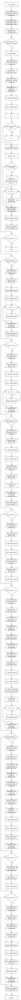

Рисунок 15 — Блок-схема функції `run_command`

## Опис тестування програм:
- *Опис логічної структури функції `int main`*: 
  
    - Основним призначенням функції є виведення результатів тестів, зокрема виведення інформації про їх виконання чи помилки.

 - *Блок-схема алгоритму функції `int main`:* (рис. 16)

   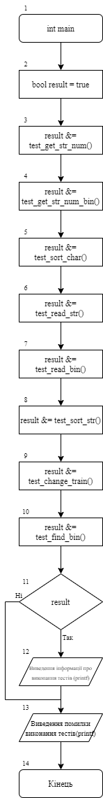

Рисунок 16 — Блок-схема функції `int main`

- *Опис логічної структури тестування функції `read_str`*: 
  
    - Даний тест перевіряє правильність зчитування з файлу масиву структур у текстовому форматі. Ми вказуємо характеристики двох конкретних потягів з файлу, зчитуємо їх та порівнюємо отримані дані з вказаними. В результаті їх рівності тест вважається виконаним успішно.

 - *Блок-схема тестування функції `read_str`:* (рис. 17)

   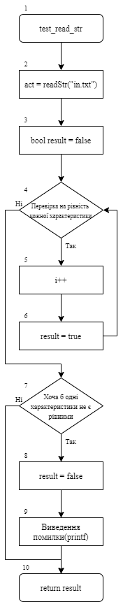

Рисунок 17 — Блок-схема тестування функції `read_str`

- *Опис логічної структури функції тестування `test_get_str_num`*: 
  
    - Даний тест перевіряє правильність отримання кількості структур. Ми вказуємо кількість і прораховуємо її програмою. Якщо при їх порівнянні вони будуть рівними, то тест виконаний успішно.

 - *Блок-схема функції тестування `test_get_str_num`:* (рис. 18)

   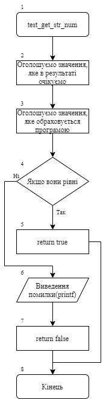

Рисунок 18 — Блок-схема функції тестування `test_get_str_num`

- *Опис логічної структури функції тестування `test_str_num_bin`*: 
  
    - Даний тест перевіряє правильність отримання кількості структур в бінарному форматі. Ми вказуємо кількість і прораховуємо її програмою. Якщо при їх порівнянні вони будуть рівними, то тест виконаний успішно.

 - *Блок-схема функції тестування `test_str_num_bin`:* (рис. 19)

   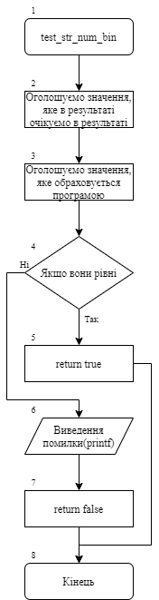

Рисунок 19 — Блок-схема функції тестування `test_str_num_bin`

- *Опис логічної структури функції тестування `test_sort_char`*: 
  
    - Даний тест перевіряє правильність виконання сортування символів структури. Ми вказуємо бажаний результат і прораховуємо його програмою. Якщо при їх порівнянні вони будуть рівними, то тест виконаний успішно.

 - *Блок-схема функції тестування `test_sort_char`:* (рис. 20)

   

Рисунок 20 — Блок-схема функції тестування `test_sort_char`

- *Опис логічної структури функції тестування `test_sort_str`*: 
  
    - Даний тест перевіряє правильність виконання сортування структур. Ми вказуємо бажаний результат і прораховуємо його програмою. Якщо при їх порівнянні вони будуть рівними, то тест виконаний успішно.

 - *Блок-схема функції тестування `test_sort_char`:* (рис. 21)

   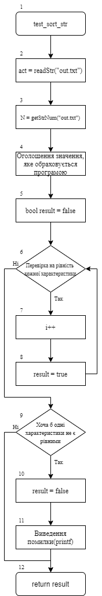

Рисунок 21 — Блок-схема функції тестування `test_sort_char`

- *Опис логічної структури функції тестування `test_change_train`*: 
  
    - Даний тест перевіряє правильність знаходження по номеру конкретного потягу та зміни його характеристик. Ми вказуємо бажаний результат і прораховуємо його програмою. Якщо при їх порівнянні вони будуть рівними, то тест виконаний успішно.

 - *Блок-схема функції тестування `test_change_train`:* (рис. 22)

   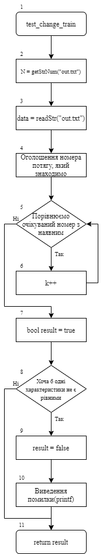

Рисунок 22 — Блок-схема функції тестування `test_change_train`

- *Опис логічної структури функції тестування `test_read_bin`*: 
  
    - Даний тест перевіряє правильність зчитування з файлу масиву структур у бінарному форматі. Ми вказуємо характеристики двох конкретних потягів з файлу, зчитуємо їх та порівнюємо отримані дані з вказаними. В результаті їх рівності тест вважається виконаним успішно.

 - *Блок-схема функції тестування `test_read_bin`:* (рис. 23)

   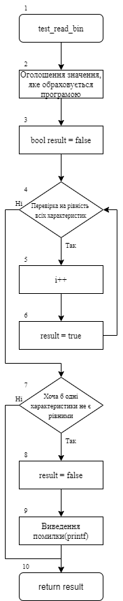

Рисунок 23 — Блок-схема функції тестування `test_read_bin`

- *Опис логічної структури функції тестування `test_find_bin`*: 
  
    - Даний тест перевіряє правильність передання об'єктів струткури фкункції по вказівнику. У нашому випадку очікуваним значенням є отримання характеристик вказаного потягу по номеру. В результаті рівності вказаного нами та прорахованого в програмі тест вважається виконаним успішно.

 - *Блок-схема функції тестування `test_find_bin`:* (рис. 24)

   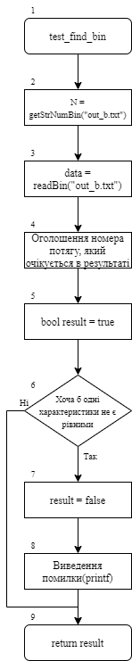

Рисунок 24 — Блок-схема функції тестування `test_find_bin`

- *Важливі елементи програми:*
    - Зчитування з файлу, записування у файл та виведення на екран масивів елементів;
    - Сортування масивів елементів за певним критерієм(полем);
    - Робота зі структурами, взаємодія з конкретними її елементами;
    - Генерація чисельних полів та передача об'єктів структури в функцію, які обов'язково повинні передаватися "за вказівником";
    - Запис та читання масиву структур у текстовому та бінарному форматах;
    - Пошук та читання структури з файлу по індексу при бінарному методі зберігання структур;
    - Розробка модульних тестів як самоперевірка коректності виконання роботи програми.
## Варіанти використання програми:
- Поставивши точку зупинки наприкінці функції побачимо результати виконання відповідних команд на виведення структури заданого каталогу і його розмір.(рис.11-12)
    
    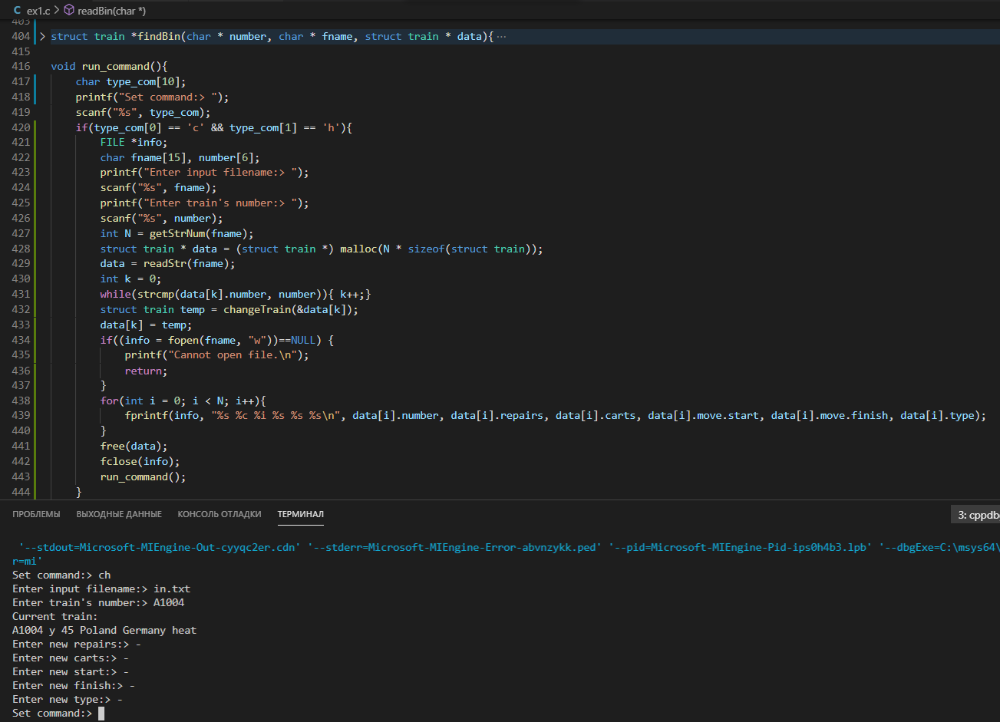

Рисунок 25 - Результати команди `ch`.

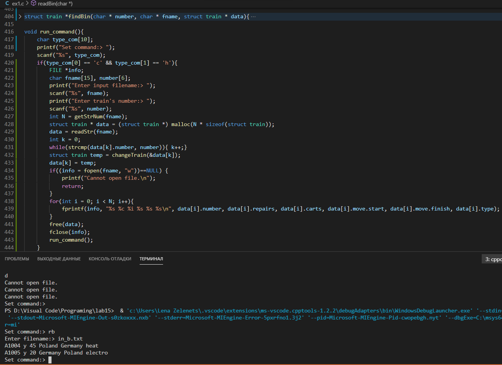

Рисунок 26 - Результати команди `rb`.

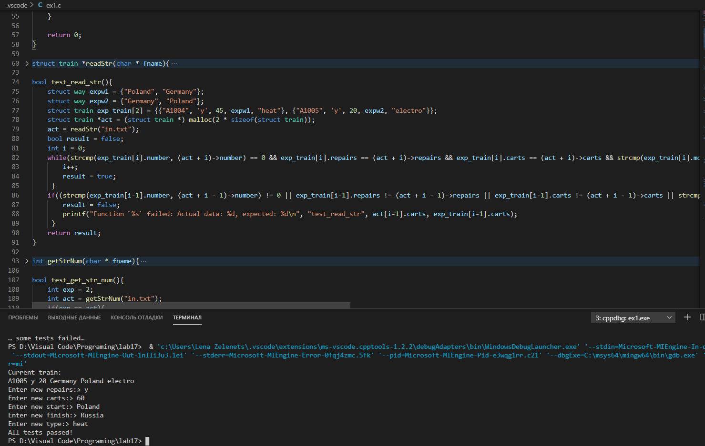

Рисунок 27 - Результат виконання всіх тестів.
## Висновок:
На цій лабораторній роботі ми закріпили знання по створенню структур, додали навички взаємодії зі структурою та з конкретними її елементами, читали з файлу, записували у файл та виводили на екран масиви елементів, сортували структури за певним критерієм(полем), здійснювали запис та читання масиву структур у текстовому та бінарному форматі, а також пошук та читання структури з файлу по індексу при бінарному методі зберігання структур. Навчилися створювати модульні тести, які дають змогу перевірити коректність роботи програми.

