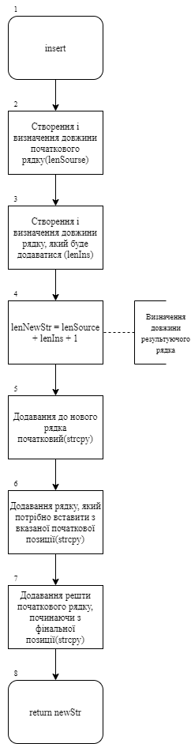
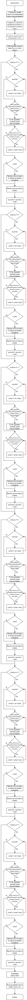
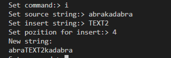
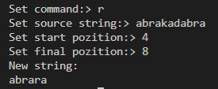
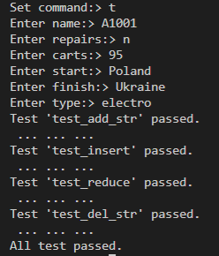
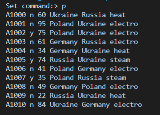
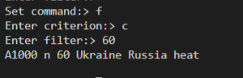
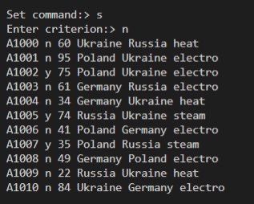
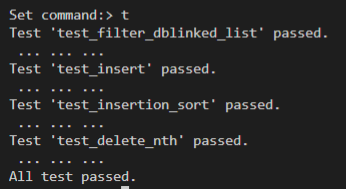

# Лабораторна робота №3
# Тема: Динамічні масиви. Динамічні списки.
## Вимоги:
-   Розробник: Зеленець Олена, група КІТ-120а
-   Перевірив: асистент Челак Віктор Володимирович
-   Загальне завдання: Розробити функцію, яка реалізує вставку в рядок, видалення з рядка та за допомогою функцій `memcpy`, `memset` створити функції додавання та видалення елементів з динамічного масиву вашої прикладної області. Додати модульні тести, що демонструють коректність розроблених функцій. На базі цього розробленого функціоналу реалізувати функції роботи зі списком такі як: читання даних з файлу, використовуючи функцію `fscanf`; запис даних у файл, використовуючи функцію `fprintf`; пошук у списку об'єкта за заданим критерієм; додавання в кінець списку та видалення зі списку. Також реалізувати далоговий режим спілкування з користувачем за допомогою меню, переробити метод додавання з можливістю вставлення додаткового елементу після будь-якого елементу списку, продемонструвати відсутність витоків пам'яті, розробити модульні тести, що демонструють коректність роботи реалізованих функцій. Проект має складатися мінімум з 6 файлів.
- Індивідуальне завдання: 
   - Виконати завдання на оцінку "задовільно" та "добре" згідно варіанту; реалізувати сортування вмісту списку за одним з критеріїв. При цьому обов'язково забезпечити, щоб обмін місцями об'єктів здійснювався шляхом обміну їх показчиків.

 ## Опис програми:

 - *Функціональне призначення*:  Реалізація повноцінної роботи з динамічним масивом.
  - *Опис логічної структури функції `insert`*: 
  
    - Створюємо і визначаємо довжину рядків, який міститиме початковий текст та текст, який потрібно вставити. Створюємо змінну позиції, з якої повинно відбуватися додавання. Створюємо новий рядок, який міститиме у собі результуючі дані. За допомогою функції `strcpy` реалізовуємо запис у результуючий масив тексту початкового рядку до вказаної позиції, текст-вставку та решту початкового рядка.
- *Блок-схема алгоритму функції `insert`:* (рис. 1)

   

 - *Опис логічної структури функції `test_insert`*: 
  
    - Створюємо початковий рядок, текст, який повинен вставитися та позицію, з якої ця вставка повинна відбутися. Вказуємо, який рядок в результаті ми очікуємо та порівнюємо з результатом виконання функції `insert`. 

 - *Опис логічної структури функції `test_add_str`*: 
  
    - Цей тест перевіряє коректність роботи функції додавання рядка. Ми передбачаємо, що додасться потяг А1001 з відповідними характеристиками на номері рядка 2, позиція 2. Порівнюємо результат виконання функції з нашими очікуваними характеристиками. З консолі вводимо дані. Якщо хоча б одні характеристики не співпадають, то тест вважається не виконаним і при виводі вказується, що ми очікували.
    
- *Опис логічної структури функції `del_str`*: 
  
    - Видалення здійснюється на основі запису в тимчасову змінну всіх рядків до позиції, яка має бути видалена, та відповідно після вказаної позиції.

- *Опис логічної структури функції `test_del_str`*: 
  
    - Ми передбачаємо, що видалиться потяг номера рядка 1 та позиції 2. Порівнюємо масив, який повинен бути отриманим після видалення потягу з масиву, з масивом, який ми отримуємо після виклику функції `del_str`.

- *Опис логічної структури функції `add_str`*: 
  
    - Вводимо та приймаємо значення потягу, який повинен додатися і в якій позиції. У тимчасову змінну записуємо потяги до вказаної позиції, наш введений потяг та потяги після вказаної позиції.

- *Опис логічної структури функції `test_reduce`*: 
  
    - Створюємо початковий рядок, текст, який повинен видалитися та позицію, з якої це видалення  повинно відбутися. Вказуємо, який рядок в результаті ми очікуємо та порівнюємо з результатом виконання функції reduce. 

- *Опис логічної структури функції `reduce`*: 
  
    - Створюємо і визначаємо довжину рядка, який міститиме у собі початковий текст. Також створюємо новий рядок, який міститиме у собі результат – початковий рядок без частини, яка повинна видалитися. Реалізуємо видалення за допомогою функції `strcpy`, яка копіює в результуючий масив початковий рядок до стартової позиції та весь той текст, який після вказаної фінальної позиції.

- *Функціональне призначення*:  Реалізація повноцінної роботи з динамічним списком.

 - *Опис логічної структури функції `int main`*: 
  
    - Дана функція викликає функції знаходження номеру потяга, считування даних з файлу та перетворення з масиву в список. Далі викликається функція `run_command`для вибору виконання конкретних поставлених перед нами задач. В результаті очищується список перед повторним запуском і операціями.

 - *Опис логічної структури функції `run_command`*: 
  
    - Призначення даної функції полягає у тому, що через консоль вводяться команда(під ними розуміються функції), яка розпочинає виконання конкретної потрібної нам задачі. Це команди виходу з програми, виведення списку, зчитування та запису, створення нового потягу, починаючи з потрібного нам індексу, видалення починаючи з потрібного індексу, фільтр(тобто пошук), сортування та виконання тестів.

 - *Опис логічної структури функції `insertionSort`*: 
  
    - Спочатку створюємо новий двонапрямлений список. Далі вказуємо критерій, який потрібно відсортувати. Вставляємо в список перший елемент невідсортованого списку. Для вставки другого елементу проходимо по відсортованому списку, якщо це значення є меншим, то йде наперед, в іншому випадку іде в кінець списку. Таким чином дані відсортуються від найбільшого до найменшого.
    
   - *Блок-схема алгоритму функції `insertionSort`:* (рис. 1)

   

 - *Опис логічної структури функції `createDblLinkedList`(створення двонапрямленого списку)*: 
  
    - Ця функція створює екземпляр структури DblLinkedList. Тобто виділяє пам’ять на список, оголошує змінну його розміру, а також оголошує, що `head` та `tail` вказують на NULL, бо поки що наш список є пустим.

 - *Опис логічної структури функції `deleteDblLinkedList`(видалення двонапрямленого списку)*: 
  
    - Видалення двонапрямленого списку реалізується шляхом проходження по всьому списку і зануленням кожної комірки і після цього очищенням всього `*list` за допомогою `free`.

 - *Опис логічної структури функції `pushFront`(вставка в початок списку)*: 
  
    - Спочатку створюється новий елемент , потім задаємо йому значення. Так як він став першим, то вказівник next вказує на стару голову списку, а попереднього елементу немає. Але якщо уже був елемент голови, то його вказівник prev повинен вказувати на тільки що створений елемент. Тоді виконується перевірка вказівника tail. Якщо він пустий, то після того як додаємо новий елемент, він повинен вказувати на цей елемент. І в результаті перекидаємо вказівник head на створений елемент і збільшуємо значення size.

 - *Опис логічної структури функції `popFront`(видалення початку списку)*: 
  
    - Спочатку створюємо вказівник на перший елемент списку для того, щоб після всіх змін вказівників prev та next ми змогли видалити потрібний вузол. Далі перекидаємо вказівник head на наступний за ним елемент. Далі перевіряємо чи елемент, який ми видаляємо не може бути одночасно останнім(це означає, що в списку лише один елемент), після цього звільняємо пам’ять.

 - *Опис логічної структури функції ``pushBack`(вставка в кінець списку)*: 
  
    - Спочатку створюється новий елемент , потім задаємо йому значення. Так як він став останнім, то вказівник prev вказує на старий хвіст списку, а наступного елементу немає. Але якщо уже був елемент хвоста, то його вказівник next повинен вказувати на тільки що створений елемент. Тоді виконується перевірка вказівника head. Якщо він пустий, то після того як додаємо новий елемент, він повинен вказувати на цей елемент. І в результаті перекидаємо вказівник tail на створений елемент і збільшуємо значення size.

 - *Опис логічної структури функції `popBack`(видалення кінця списку)*: 
  
    - Спочатку створюємо вказівник на останній елемент списку для того, щоб після всіх змін вказівників prev та next ми змогли видалити потрібний вузол. Далі перекидаємо вказівник tail на попередній елемент. Далі перевіряємо чи елемент, який ми видаляємо не може бути одночасно останнім(це означає, що в списку лише один елемент), після цього звільняємо пам’ять.

 - *Опис логічної структури функції `getNth`(отримання n-го елемента)*: 
  
    - У залежності від індекса можемо проходитися по списку або з початку в кінець, або з кінця на початок. Це дозволяє використовувати в половину менше проходів по списку.

- *Опис логічної структури функції `test_insert`*: 
  
    - За допомогою функції `getStrNum` отримуємо номер поїзду, який був вставлений, за допомогою функції `readStr` зчитуємо його та за допомогою функції `fromArray` переводимо з масиву в список. В дані записуємо потяг, який ми очікуємо отримати в результаті. Порівнюємо його з результатом виконання функції `insert`.

- *Опис логічної структури функції `insert`(вставка вузлу в список)*: 
  
    - Спочатку знаходимо потрібний елемент, з якого повинна бути виконана вставка і потім створюємо новий вузол. У результаті змінюємо всі вказівники.

- *Опис логічної структури функції `test_delete_nth`*: 
  
    - За допомогою функції `getStrNum` отримуємо номер поїзду, який повинен видалитися, за допомогою функції `readStr` зчитуємо його та за допомогою функції `fromArray` переводимо з масиву в список. В дані записуємо потяг, який ми очікуємо, що видалимо в результаті. Порівнюємо його з результатом виконання функції  `deleteNth `.

- *Опис логічної структури функції `deleteNth`(вставка вузлу в список)*: 
  
    - Спочатку знаходимо потрібний елемент, з якого повинне бути виконане видалення і потім створюємо вказівник на елемент, що видаляється. У результаті змінюємо всі вказівники.

- *Опис логічної структури функції `printDblLinkedList`*: 
  
    - Виводить двонаправлений список потягів на екран. Виведення здійснюється шляхом друку поелементно.

- *Опис логічної структури функції `fprintTrain`*: 
  
    - Відкриття файлу в режимі читання та запису. Виведення в файл структур за допомогою функції `fprintf`. Закриття файлу (fclose).

- *Опис логічної структури функції `fprintDblLinkedList`*: 
  
    - Відкриття файлу в режимі запису. І якщо список існує(тобто він не пустий), то проходиться по всьому списку і виводиться за допомогою функції `fprintTrain`.

- *Опис логічної структури функції `fromArray`*: 
  
    - Дана функція створює список з масиву. Спочатку йде перевірка чи не є пустим масив, і потім з цього масиву утворюється список за допомогою функції `createDblLinkedList`.

- *Опис логічної структури функції test_filter_dblinked_list`*: 
  
    - За допомогою функції `getStrNum` отримуємо номер поїзду, значення якого будемо шукати, за допомогою функції `readStr` зчитуємо його та за допомогою функції `fromArray` переводимо з масиву в список. Далі записуємо дані, які ми очікуємо отримати в результаті пошуку. Порівнюємо його з результатом виконання функції  `FilterDblLinkedList`.

- *Опис логічної структури функції `FilterDblLinkedList`*: 
  
    - Створюємо новий список, у який будемо результат нашого фільтру. Далі вводимо, у якій характеристиці будемо здійснювати пошук необхідного значення. Далі відповідно будуть порівнюватися усі значення даного критерія до тих пір, поки не знайдемо потрібний. Виводимо у кінець створеного списку за допомогою функції `pushBack`.

- *Опис логічної структури функції `insertBeforeElement` (вставка до вказаного елемента)*: 
  
    - Ця функція буде отримувати вказівник на список та вказівник на вузол перед яким потрібно вставити новий елемент і нові дані. Ну і в кінці відповідно збільшуємо наш розмір списку.

- *Опис логічної структури функції `test_insertion_sort``*: 
  
    - За допомогою функції `getStrNum` отримуємо номери потягів з файлу `t_sort.out`, значення якого відсортовані, за допомогою функції `readStr` зчитуємо та за допомогою функції `fromArray` переводимо з масиву в список. Далі таким же чином зчитуємо дані з файлу `t_sort.in`, які ми очікуємо отримати в результаті сортування. Порівнюємо ці дані з результатом виконання функції  `insertionSort `.

- *Важливі елементи програми:*
    - Робота з динамічним масивом.
    - Робота з двонапрямленим списком.
    - Застосування функцій `memcpy`та `memset`.
    - Пошук по заданому критерію.
    - Сортування за одним з критеріїв, щоб обмін місцями об'єктів здійснювався шляхом обміну їх показчиків.
## Варіанти використання програми:
- Реалізація функції вставки в рядок(рис.2)
    
    

Рисунок 2 - Результати функції `insert`.

- Реалізація функції видалення із рядка(рис.3)
    
    

Рисунок 3 - Результати функції `reduce`.

- Перевірка коректності роботи програми за допомогою тестів(рис.4)
    
    

Рисунок 4 - Результати виконання тестів.

- Реалізація функції виводу списку на екран(рис.5)
    
    

Рисунок 5 - Вивід списку на екран.

- Реалізація функції пошуку за заданим критерієм(рис.6)
    
    

Рисунок 6 - Пошук за критерієм.

- Реалізація функції сортування за заданим критерієм(рис.7)
    
    

Рисунок 7 - Результати сортування за номером.

- Перевірка коректності роботи програми за допомогою тестів(рис.8)
    
    

Рисунок 8 - Результати виконання тестів.

## Висновок:
На цій лабораторній роботі ми закріпили знання по створенню структур, додали навички роботи з динамічними масивами та динамічними списками(зокрема з двонапрямленим списком). 

