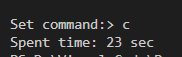

# Лабораторна робота №4
# Тема: Макровизначення
## Вимоги:
-   Розробник: Зеленець Олена, група КІТ-120а
-   Перевірив: асистент Челак Віктор Володимирович
-   Загальне завдання: До попередньо розробленого функціоналу по роботі з приклданою областю за допомогою макровизначень зробити задану в завданні "кастомізацію", при чому при виклику кожної функції роботи з прикладною областю виводити поточну дату та час, виводити ім'я поточної функції та при завершуні програми вивести загальний час роботи програми.
- Індивідуальне завдання: 
   - Окрім загального завдання, при запуску кожного тесту виводити ім'я тесту, а по завершенні тесту виводити, що було витрачено на виконання даного тесту. По завершенні всіх тестів вивести час їх виконання.


 ## Опис програми:

- *Загальне завдання виконується за допомогою таких розроблених функцій:*:  

    
 - *Опис логічної структури функції `int_main`*: 
  
    - Дана функція викликає функції знаходження номеру потяга, считування даних з файлу та перетворення з масиву в список. Далі викликається функція `run_command`для вибору виконання конкретних поставлених перед нами задач. В результаті очищується список перед повторним запуском і операціями.

 - *Опис логічної структури функції `insert`(вставка вузлу в список)*: 
  
    - Спочатку знаходимо потрібний елемент, з якого повинна бути виконана вставка і потім створюємо новий вузол. У результаті змінюємо всі вказівники. 

 - *Опис логічної структури функції `deleteNth`*: 
  
    - Cпочатку знаходимо потрібний елемент, з якого повинне бути виконане видалення і потім створюємо вказівник на елемент, що видаляється. У результаті змінюємо всі вказівники.
    
- *Опис логічної структури функції `printDblLinkedList`*: 
  
    - Виводить двонаправлений список потягів на екран. Виведення здійснюється шляхом друку поелементно.

- *Опис логічної структури функції `fprintDblLinkedList`*: 
  
    - Відкриття файлу в режимі запису. І якщо список існує(тобто він не пустий), то проходиться по всьому списку і виводиться за допомогою функції `fprintTrain`.

- *Опис логічної структури функції `FilterDblLinkedList`*: 
  
    - Створюємо новий список, у який будемо результат нашого фільтру. Далі вводимо, у якій характеристиці будемо здійснювати пошук необхідного значення. Далі відповідно будуть порівнюватися усі значення даного критерія до тих пір, поки не знайдемо потрібний. Виводимо у кінець створеного списку за допомогою функції `pushBack`.

- *Опис логічної структури функції `insertionSort`*: 
  
    - Спочатку створюємо новий двонапрямлений список. Далі вказуємо критерій, який потрібно відсортувати. Вставляємо в список перший елемент невідсортованого списку. Для вставки другого елементу проходимо по відсортованому списку, якщо це значення є меншим, то йде наперед, в іншому випадку іде в кінець списку. Таким чином дані відсортуються від найбільшого до найменшого.
    
   - *Блок-схема алгоритму функції `insertionSort` з виконанням загального завдання:* (рис. 1)

   

- *Важливі елементи програми:*
    - Основне завдання у даних програмах даної прикладної області виконується завдяки наступному опису макросу `DEBUG`:
        ``` #ifdef DEBUG
        printf("Назва функції або тесту\n");
        const time_t timer = time(NULL);
        printf("%s\n", ctime(&timer));
        #endif ```

    - Час та дата виконання усієї програми реалізується в функції `int_main`.
    - Основне завдання щодо тестів реалізується як і у функціях кожного тесту, так і у функції `run_command`, щоб виводити час виконання та назви усіх тестів разом.

## Варіанти використання програми:
- Реалізація функції сортування по заданому критерію `insertionSort` з виконанням загального завдання(рис.2)
    
    

Рисунок 2 - Результати функції `insertionSort`.

- Демонстрація часу виконання всієї програми після її завершення(рис.3)
    
    

Рисунок 3 - Час, затрачений на виконання усієї програми.

- Перевірка коректності роботи програми за допомогою тестів з виконанням загального завдання(рис.4)
    
    

Рисунок 4 - Результати виконання тестів з часом, затраченим на їх виконання.

## Висновок:
На цій лабораторній роботі ми навчилися працювати з макровизначеннями. Використовувати їх в залежності від різного роду задач. Навчилися обраховувати час, який витрачається на роботу не залежно від того чи це час на одну певну функцію чи взагалі на всю програму.


