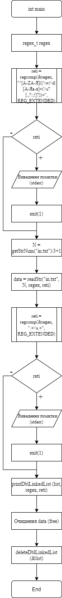
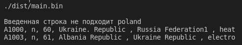

# Лабораторна робота №6
# Тема: Регулярні вирази
## Вимоги:
-   Розробник: Зеленець Олена, група КІТ-120а
-   Перевірив: асистент Челак Віктор Володимирович
-   Загальне завдання: Поширити попередню лабораторну роботу таким чином:
    - при введенні інформації про "базовий тип" (нема різниці, чи з клавіатури, чи з файлу), організувати перевірку відповідності таким критеріям з використанням регулярних виразів:
        - можна вводити тільки кириличні символи, латинські символи, цифри, пропуски, розділові знаки;
        - не повинно бути пропусків та розділових знаків, які повторюються;
        - перше слово не повинно починатися з маленького символу;
    - у клас-список додати метод, що виводить на екран список усіх об'єктів, які мають одне або більше полів з щонайменше двома словами (перевірку організувати за допомогою регулярних виразів).

 ## Опис програми:

- *Загальне завдання виконується за допомогою таких розроблених функцій:*:  

    
 - *Опис логічної структури функції `int_main`*: 
  
    - Дана функція компілює основний регулярний вираз та регулярний вираз на перевірку наявності в полях `start` і `finish` двоє і більше слів.

- *Опис логічної структури функції `readStr`*: 
  
    - Ця функція реалізовує правильне зчитування з файлу. Але так як ми "розбивали" наш рядок на три рядка, то поля `start` і `finish` ми зчитуємо окремо і визначаємо чи відповідають вони регулярному виразу, і якщо відповідають, то додаються в список.

- *Опис логічної структури функції `printDblLinkedList`*: 
  
    - Дана функція реалізовує виведення полів `start` і `finish` лише тих, які відповідають відповідному регулярному виразу. Якщо `start` і `finish` відповідають регулярному виразу, то відбувається виведення всіх потягів на екран.
    
   - *Блок-схема алгоритму функції `int_main` з виконанням загального завдання:* (рис. 1)

   

## Варіанти використання програми:
- Заповнення полів в результаті перевірки тексту за допомогою регулярних виразів.(рис.2)
    
    

    
## Висновок:
На цій лабораторній роботі ми навчилися працювати з регулярними виразами, щоб заповнення полів відбувалося лише з дотриманням заданих нами критеріїв.

