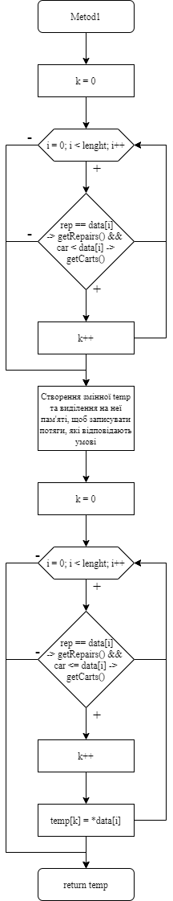
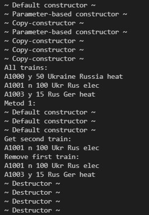
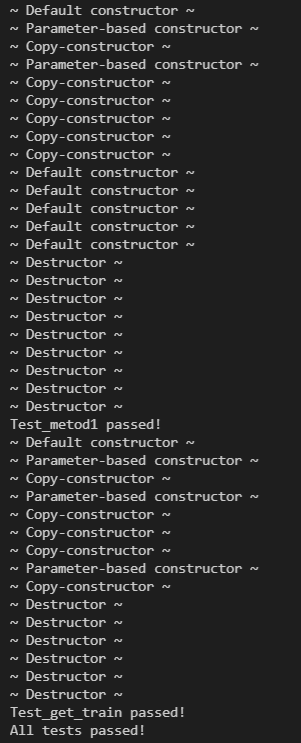
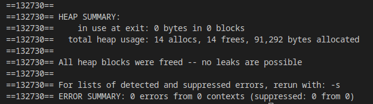

# Лабораторна робота №7
# Тема: ООП. Вступ до ООП.
## Вимоги:
-   Розробник: Зеленець Олена, група КІТ-120а
-   Перевірив: асистент Челак Віктор Володимирович
-   Загальне завдання: Для предметної галузі з розділу "Розрахункове завдання / Індивідуальні завдання" розробити два класи: - клас, що відображає сутність "базового класу", у тому числі: - конструктор за замовчуванням, копіювання та конструктор з аргументами (реалізація конструкторів повинна бути продемонстрована за допомогою списків ініціалізацій); - деструктор; - клас, що має у собі динамічний масив об'єктів базового класу та має в собі методи додавання, видалення елемента, отримання елемента по індексу (або ідентифікатору), вивід усіх елементів на екран. Рекомендовані сигнатури методів: 
    - додавання:
    ``` void CList: :addPhone (Phone& phone) ```
    - видалення:
    ``` void CList: : removePhone (int index) ```
    - отримання по індексу:
    ``` CPhone& CList: :getPhone (int index) ```
    - виведення усіх елементів (при цьому цей метод повинен викликати метод
    ``` CList: :getPhone ```(int index), щоб не було дублювання коду):
    ``` void CList: ishowA11 ```
    - метод 1 обходу колекції. Приклад сигнатури такого методу (У наведеному
прикладі реалізоване завдання пошуку самого дешевого телефону з
заданою діагоналлю (повертається один телефон):
    ``` findCheapestPhone (float diagonal); ```
- Індивідуальне завдання: 
   - Обрати прикладну галузь за варіантом відповідно до номера у журналі групи.


 ## Опис програми:

- *Загальне завдання виконується за допомогою таких розроблених функцій:*:  

    
 - *Опис логічної структури функції `int_main`*: 
  
    - Дана функція створює об'єкт класу-списку та викликає його методи. Також дана функція виконує перевірку роботи тестів та виводить відповідні повідомлення.
    
- *Опис логічної структури функції `рrintTrain`*: 
  
    - Виводить всі характеристики потяга на екран. 

- *Опис логічної структури функції `showAll`*: 
  
    - Виводить весь масив потягів на екран. Виведення здійснюється шляхом використання функції `рrintTrain`.

- *Опис логічної структури функції `аddTrain`*: 
  
    - Дана функція здійснює додавання нового потягу шляхом збільшення розміру та створення нового потягу згідно зразка.

- *Опис логічної структури функції `removeTrain`*: 
  
    - Приймає індекс елемента, який потрібно видалити та записує інші у новостворений масив розміром на 1 менше.

- *Опис логічної структури функції `getTrain`*: 
  
    - Дана функція забезпечує отримання потяга по індексу.

- *Опис логічної структури функції `Metod1`*: 
  
    - Дана функція відповідає за роботу 1 методу обходу колекції. У нашому випадку ми отримуємо дані про кількість вагонів у кожному потязі та дані про необхідність ремонту. За нашою умовою в результаті цієї функції мають бути отримані потяги, кількість вагонів яких більша ніж 10 та вони потребують ремонту. Тому ми перевіряємо всі потяги на відповідність даної умови та отримуємо тільки ті потяги, які відповідають даним критеріям.
    
   - *Блок-схема алгоритму функції `Metod1` з виконанням загального завдання:* (рис. 1)

   

## Варіанти використання програми:
- Реалізація функцій виведення всіх потягів на екран за допомогою `PrintTrain`, виконання `Metod1`, отримання потяга по індексу `getTrain` та видалення одного потяга за допомогою `removeTrain`. Демонстрація роботи конструкторів та деструкторів.(рис.2)
    
    

- Перевірка коректності роботи програми за допомогою тестів з виконанням загального завдання. Демонстрація роботи конструкторів та деструкторів.(рис.3)
    
    

- Перевірка відсутності витоків пам'яті за допомогою утіліти valgrind(рис.4)
    
        
    
## Висновок:
На цій лабораторній роботі ми познайомилися з ООП на мові програмування С++. Навчилися розробляти класи, працювати з різними видами конструкторів та деструкторами. Створювали клас, який має у собі динамічний масив об'єктів базового класу та має в собі методи додавання, видалення елемента, отримання елемента по індексу та вивід усіх елементів на екран.


