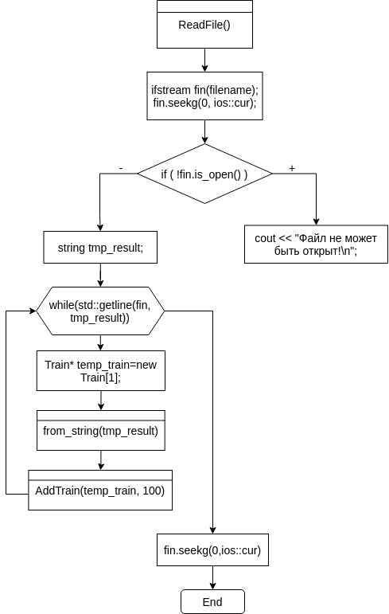
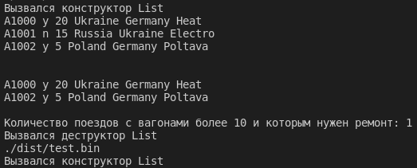
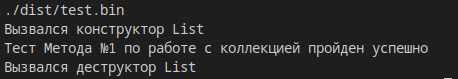

# Лабораторна робота №8
# Тема: ООП. Потоки
## Вимоги:
-   Розробник: Зеленець Олена, група КІТ-120а
-   Перевірив: асистент Челак Віктор Володимирович
-   Загальне завдання: Поширити попередню лабораторну роботу, зробити задану в завданні "кастомізацію".
- Індивідуальне завдання: 
   - Продемонструвати відсутність витоків пам'яті, роботу розроблених методів за допомогою модульних тестів

 ## Опис програми:

- *Загальне завдання виконується за допомогою таких розроблених функцій:*:  

    
 - *Опис логічної структури функції `int_main`*: 
  
    - Дана функція створює об'єкт класу-списку, та викликає його методи

 - *Опис логічної структури функції `ReadFile`(читання даних з файлу)*: 
  
    - Створює поток для читання даних, читає строку, створює об'єкт класу Train передає строку у `from_string` та отриманий об'єт з заповненими полями передає у `AddTrain`

 - *Опис логічної структури функції `WriteFile`*: 
  
    - Створює поток для запису даних у файл, викликає функцію `to_string` та записує строку у файл
    
- *Опис логічної структури функції `PrintTrain`*: 
  
    - Виводить масив потягів на екран. Виведення здійснюється шляхом виклику функції `to_string`.

- *Опис логічної структури функції `AddTrain`*: 
  
    - Приймає вказівник на об'єкт та записує його у новостворений масив розміром на 1 більше.

- *Опис логічної структури функції `DeleteTrain`*: 
  
    - Приймає індекс елемента, який потрібно видалити та записує інші у новостворений масив розміром на 1 менше.

- *Опис логічної структури функції `FindCountTrains`*: 
  
    - Перевіряє кожен єлемент масиву на відповідність умові, якщо так, то збільшує лічільник

- *Опис логічної структури функції `from_string`*: 
  
    - Приймає строку, розбиває її на елементи та записує у поля об'єкта

- *Опис логічної структури функції `to_string`*: 
  
    - За допомогою конкатенації строк, Створює строку з всих елементів об'єкта і повертає цю строку
    
   - *Блок-схема алгоритму функції `ReadFile` з виконанням загального завдання:* (рис. 1)

   

## Варіанти використання програми:
- Реалізація функцій читання з файлу `ReadFile` та виведення на екран за допомогою `PrintTrain`, також видалення елемента `DeleteTrain` і виконання методу по роботі з колекцією `FindCountTrains`(рис.2)
    
    

- Перевірка коректності роботи програми за допомогою тестів з виконанням загального завдання(рис.3)
    
    

- Перевірка відсутності витоків пам'яті за допомогою утіліти valgrind(рис.4)
    
        
    
## Висновок:
На цій лабораторній роботі ми навчилися працювати з потоками.

