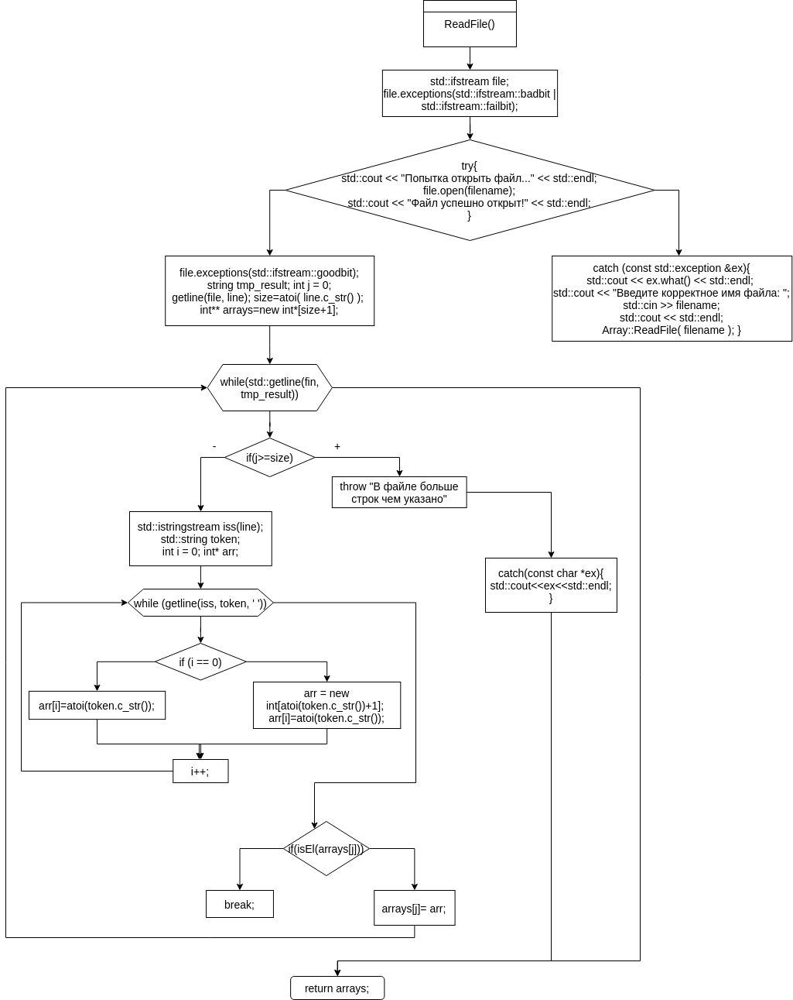
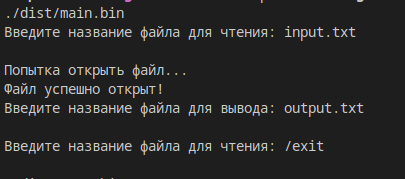
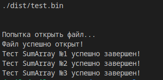
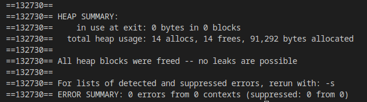

# Лабораторна робота №12
# Тема: ООП. Обробка виключних ситуацій
## Вимоги:
-   Розробник: Зеленець Олена, група КІТ-120а
-   Перевірив: асистент Челак Віктор Володимирович
-   Загальне завдання: Необхідно реалізувати програму, що виконує перераховані дії
- Індивідуальне завдання: 
   - Прочитати дані з файлу, на їх основі створити двохвимірний масив та визначити суму масивів(результат операції - масив)

 ## Опис програми:

- *Загальне завдання виконується за допомогою таких розроблених функцій :*:  

    
 - *Опис логічної структури функції `int_main`*: 
  
    - Дана функція створює об'єкт класу, та викликає його методи

 - *Опис логічної структури функції `ReadFile`(читання даних з файлу)*: 
  
    - Створює поток для читання даних, читає перший символ(цифра, яка відповідає кількості масивів), потім читає дані, тастворює на їх основі масиви
 - *Опис логічної структури функції `SumOfArrays`*: 
  
    - Спочатку шукає найдовший масив, потім сумує кожні і-ті елементи масивів і записує їх у і-тий елемент результуючого масиву
    
- *Опис логічної структури функції `WriteOut`*: 
  
    - Виводить масив на екран. 

- *Опис логічної структури функції `FreeMemory`*: 
  
    - Звільняє виділену пам'ять під масиви.
    
   - *Блок-схема алгоритму функції `ReadFile` з виконанням загального завдання:* (рис. 1)

   

## Варіанти використання програми:
- Реалізація роботи зазначених функцій(рис.2)
    
    

- Перевірка коректності роботи програми за допомогою тестів з виконанням загального завдання(рис.3)
    
    

- Перевірка відсутності витоків пам'яті за допомогою утіліти valgrind(рис.4)
    
        
    
## Висновок:
На цій лабораторній роботі ми навчилися працювати з виключними ситуаціями.

