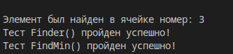
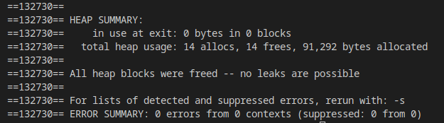

# Лабораторна робота №13
# Тема: ООП. Шаблонні функції та класи
## Вимоги:
-   Розробник: Зеленець Олена, група КІТ-120а
-   Перевірив: асистент Челак Віктор Володимирович
-   Загальне завдання: Необхідно реалізувати програму, що виконує перераховані дії
- Індивідуальне завдання: 
   - Зробити шаблоний клас-список, продемонструвати роботу з ієрархією класів

 ## Опис програми:

- *Загальне завдання виконується за допомогою таких розроблених функцій :*:  

    
 - *Опис логічної структури функції `int_main`*: 
  
    - Дана функція створює об'єкт класу, та викликає його методи

 - *Опис логічної структури функції `AddEl`(читання даних з файлу)*: 
  
    - Створює масив розміром на 1 більше за попередній, записує новий елемент в кінець
 - *Опис логічної структури функції `DeleteEl`*: 
  
    - Створює новий масив розміром на 1 менше, переписує всі старі елементи окрім того, що потрібно видалити
    
- *Опис логічної структури функції `PrintArray`*: 
  
    - Виводить масив на екран. 

- *Опис логічної структури функції `Finder`*: 
  
    - Шукає елемент який дорівнює шуканому числу.
    
- *Опис логічної структури функції `FindMin`*: 
  
    - Знаходить найменший елемент в масиві.
    
   - *Блок-схема алгоритму функції `AddEl` з виконанням загального завдання:* (рис. 1)

   

## Варіанти використання програми:
- Реалізація роботи зазначених функцій(рис.2)
    
    

- Перевірка коректності роботи програми за допомогою тестів з виконанням загального завдання(рис.3)
    
    

- Перевірка відсутності витоків пам'яті за допомогою утіліти valgrind(рис.4)
    
        
    
## Висновок:
На цій лабораторній роботі ми навчилися працювати з шаблоними класами.

