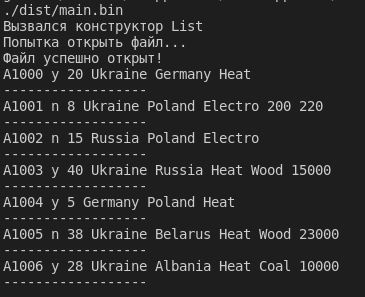

# Лабораторна робота №15
# Тема: ООП. STL. Вступ до Стандартної бібліотеки шаблонів(частина 2)
## Вимоги:
-   Розробник: Зеленець Олена, група КІТ-120а
-   Перевірив: асистент Челак Віктор Володимирович
-   Загальне завдання: Розширивши попередню лабораторну роботу, зробити клас-список ітеративним.


 ## Опис програми:

- *Загальне завдання виконується за допомогою допомогою розроблених методів begin() та end() (рис. 1):*:  

   

Рисунок 1 - Реалізація методів begin() та end()

- *Важливі елементи програми:*
    - *Метод begin():*
    ```
    iterator begin()
    {
        return trains.begin();
    }
    ```

    - *Метод end():*
    ```
    iterator end()
    {
        return trains.end();
    }
    ```
    - *Демонструю ітеративність за допомогою наступного коду:*
    ```
    List<Train*> list=List<Train*> ();

    list.ReadFile("input.txt");

    for(Train* &o : list){
        cout<<o->to_string()<<endl;
        cout << "------------------" << endl;
    }
    ```
    
## Варіанти використання програми:
- Реалізація роботи STL ітеративного класу-списка(рис.2)
    
     

Рисунок 2 - Результати виконання програми
    
## Висновок:
На цій лабораторній роботі ми продовжити працювати зі Стандартною бібліотекою шаблонів, поширили знання про неї. Реалізовували завдання шляхом роботи з ітераторами та створювали власні ітеративні контейнери. Працювали з STL-контейнерами, їх методами.


