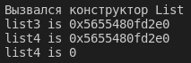

# Лабораторна робота №16
# Тема: ООП. Розумні вказівники
## Вимоги:
-   Розробник: Зеленець Олена, група КІТ-120а
-   Перевірив: асистент Челак Віктор Володимирович
-   Загальне завдання: 
    - Створити STL-контейнер, що містить об'єкти ієрархії класів та використати в ньому розумні вказівники:
        - ```unique_ptr```
        - ```shared_ptr```
        - ```weak_ptr```


 ## Опис програми:

- *Загальне завдання виконується за допомогою таких розумних вказівників: ```unique_ptr```, ```shared_ptr``` та ```weak_ptr```, розглянемо їх загальні характеристики та реалізацію (рис. 1)*:  

    - Розумний вказівник ```unique_ptr``` - це розумний вказівник, є заміною ```auto_ptr``` в C++11. Використовується для управління будь-яким видом динамічно виділеного об'єкту або ресурсу, але з умовою, що вказівник повністю володіє переданим йому об'єктом, а не «ділиться володінням» ще з іншими вказівниками. Таким чином, не можна unique_ptr покажчику присвоїти інший unique_ptr покажчик, який посилається на інший об'єкт. Розумний вказівник ```unique_ptr``` знаходить в файлі заголовків ```memory```.
    
    - Розумний вказівник ```shared_ptr``` - це вказівник, який використовується для володіння одним динамічно виділеним ресурсом відразу декількома розумними покажчиками. Ресурс буде знищений, коли останній ```shared_ptr``` вийде з так званої "зони видимості".

    - Розумний вказівник ```weak_ptr``` - це вказівник, який використовується для вирішення проблеми «циклічної залежності», яку може створити ```shared_ptr```. ```weak_ptr``` є «спостерігачем» - він може спостерігати і отримувати доступ до того ж об'єкту, на який вказує ```shared_ptr```, але не рахуватися власником цього об'єкта. Він перевіряє, чи є інші власники ```shared_ptr```. Головна особливість, що ```weak_ptr``` не є власником.
   - *Блок-схема алгоритму функції `ReadFile` з виконанням загального завдання:* (рис. 1)

   

Рисунок 1 - Створення контейнеру на основі ```unique_ptr```, ```shared_ptr``` та ```weak_ptr```.

## Варіанти використання програми:
- Демонстрація контейнеру на основі ```unique_ptr```(рис.2)
    
    

Рисунок 2 - Демонстрація контейнеру на основі ```unique_ptr```

- Демонстрація контейнеру на основі ```shared_ptr``` та ```weak_ptr``` (рис.3)

    

Рисунок 3 - Демонстрація контейнеру на основі ```shared_ptr``` та ```weak_ptr```
    
    
## Висновок:
На цій лабораторній роботі ми навчилися працювати з розумними вказівниками, також продовжили працювати зі Стандартною бібліотекою шаблонів, поширили знання про неї. Працювали з STL-контейнерами, їх методами. Навчились реалізовувати та використовувати розумні вказівники та дізналися різницю між ними.


