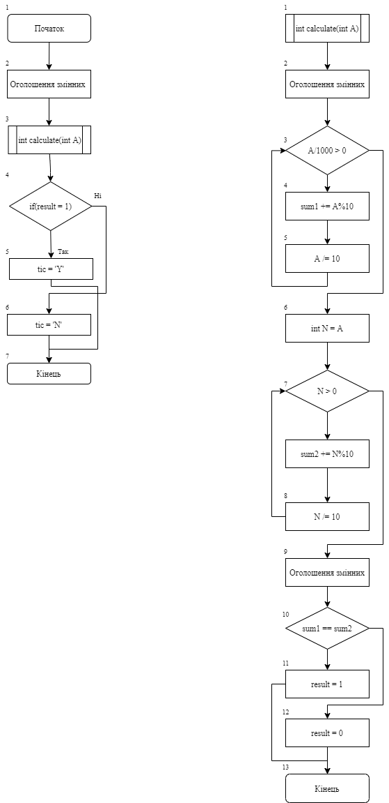
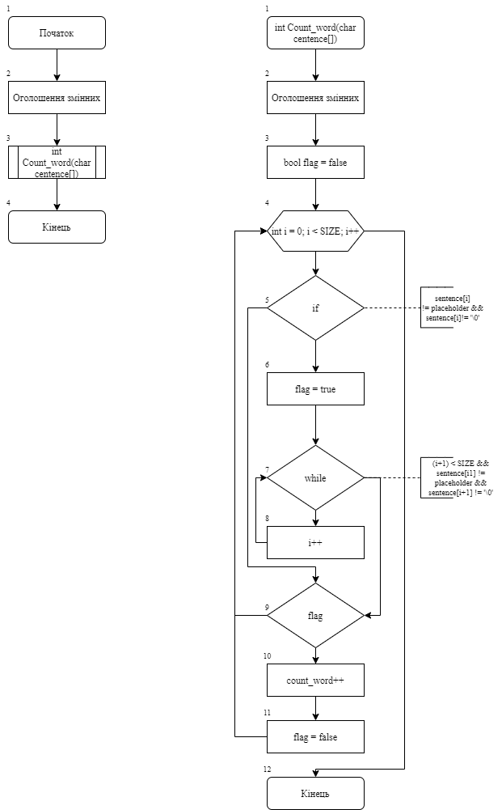
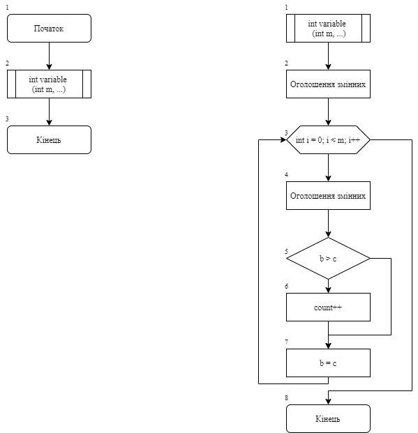

# Лабораторна робота №10. Вступ до документації проекту.
## Вимоги: 
* *Розробник*: студентка Зеленець Олена, група КІТ-120а.

* *Перевірив*: асистент Челак Віктор Володимирович.

* *Загальне завдання*: Реалізувати програми з використанням функції.
* *Індивідуальне завдання*: 
  * Визначити, чи є ціле 6-значне число «щасливим» квитком («щасливий квиток» - це квиток, у якому сума першої половини чисел номера дорівнює сумі другої половини).
  * У заданому тексті знайти кількість слів за умови, що між словами може бути будь яка кількість пропусків.
  * Реалізувати функцію, що визначає, скільки серед заданої послідовності чисел таких пар, у котрих перше число менше наступного, використовуючи функцію з варіативною кількістю аргументів.

### Опис програми 1:
* *Функціональне призначення*: Визначення чи є номер квитка "щасливим", тобто чи дорівнює сума перших та останніх 3 цифр 6-значного числа.
*  *Опис логічної структури:*
  * Функція `main` оголошує функцію `calculate`(блок 3) та вказуємо значення змінних та змінну result, яка відповідає за визначення результату(блок 2). Далі у змінній result викликається наше значення функції і вказуються умови, при яких наш квиток є «щасливим» чи навпаки(блок 4-6). (рис.1) 
  * Функція `calculate` виконує алгоритм дій, при яких будуть відокремлюватися перші та останні три цифри нашого 6-значного числа(блок 3-8). І тепер виконується умова, при якій прирівнюється sum1 та sum2(блок10) і в результаті рівності result = 1, тобто true, а коли sum1 не дорівнює sum2, result = 0, тобто false(блок 11-12)/(рис.1)


* *Структура програми:*
```
        └── lab10/
            ├── Doxyfile
            ├── Makefile
            ├── README.md
            ├── doc/
            │   ├── lab_10.md
            │   └── lab_10.pdf
            ├──└── src/
            │       └── main.c
```
* *Важливі елементи програми*:
   * Формування змінних. Відокремлення перших та останніх 3 цифр 6-значного числа, порівняння їх сум.
### Опис програми 2:
* *Функціональне призначення*: Порахувати кількість слів за умови, що між словами можу бути будь-яка кількість пропусків.
* *  *Опис логічної структури:*
  * У функції `int main` оголошуємо змінні(блок 2) та функцію `Cound_word`(блок 3) (рис.2)
  * У функції `Cound_word` оголошуємо змінні (блок 2), вказуємо значення флагу (блок 3). Описуємо умови, при яких у заданому тексті знаходимо кількість слів (блок 4-9) та в змінну `сound_word` записується результат виконання функції (блок 10) (рис.2)

* *Структура програми:*
```
        └── lab10/
            ├── Doxyfile
            ├── Makefile
            ├── README.md
            ├── doc/
            │   ├── lab_10.md
            │   └── lab_10.pdf
            ├──└── src/
            │       └── main.c
```
* *Важливі елементи програми*:
   * Оголошення функції та за допомогою неї визначення кількості слів, яке записується у змінну `сound_word`* 
### Опис програми 3:
*Функціональне призначення*: Реалізування фукції, що буде визначати кількість пар у яких перше число менше за наступне.
*Опис логічної структури*:
  *  Функція ``main``.  Оголошує змінну, що відповідає за функціональне призначення та показує кількість пар, у який перше число менше за наступне. Викликає функцію `variable`(блок 2). (рис.3)
  * У функції `variable` оголошуємо змінну, що відповідає за наше функціональне призначення(блок 2). Далі умови, при яких порівнюються значення з попереднім значенням (блок 3-7) `result` змінюється після перевірки на те, чи задовільняється умова.
  * Схеми алгоритмів функцій:

* *Структура програми:*
```
        └── lab10/
            ├── Doxyfile
            ├── Makefile
            ├── README.md
            ├── doc/
            │   ├── lab_10.md
            │   └── lab_10.pdf
            ├──└── src/
            │       └── main.c
```
* *Важливі елементи програми*:
   * Виконання порівняння значення з попереднім значенням. Поставивши точку зупинки наприкінці головної функції побачимо результат змінної, яка показує скільки пар чисел, які відповідають заданій умові.* * 
## Висновок:
Для виконання лабораторної роботи ми навчились створювати та реалізовувати алгоритми функції, створювати схеми алгоритмів, та оформляти документацію.


